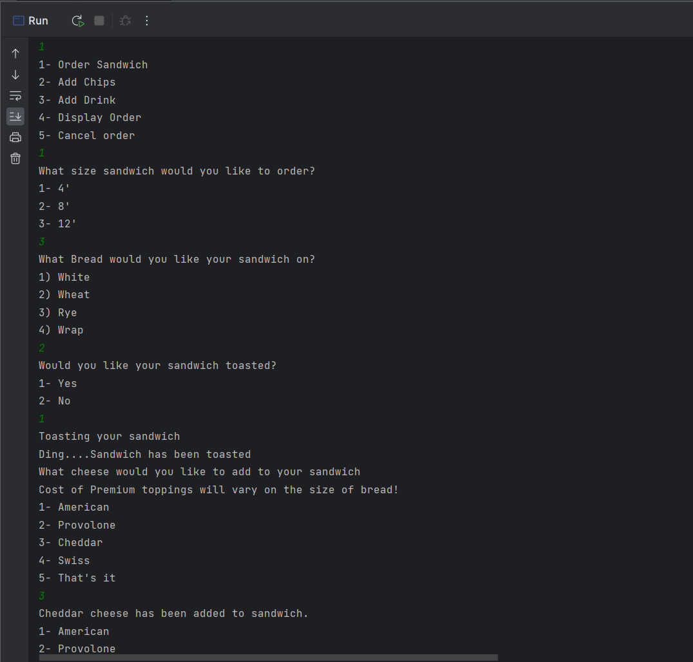
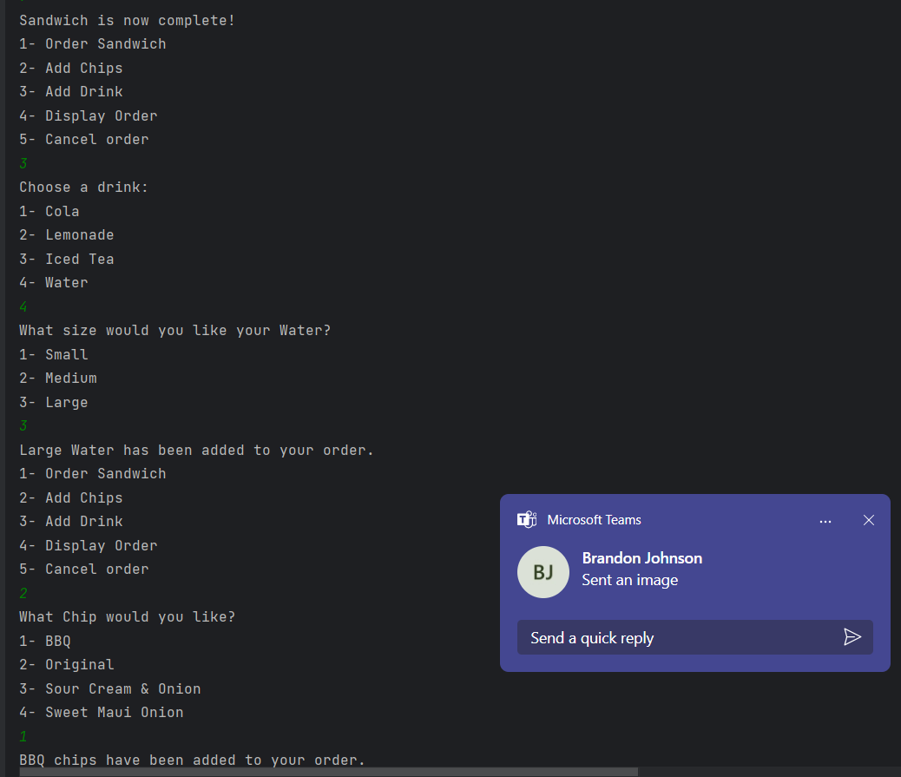
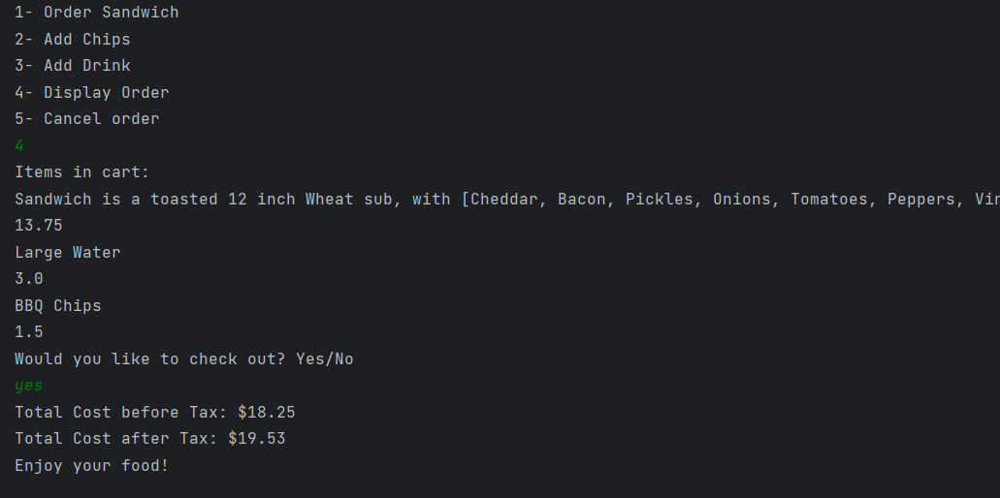

# Project Title

## Description of the Project

Welcome to our online sandwich shop, where you can fully customize your sandwich experience. Not only can you create your perfect sandwich with a variety of options, but you can also pair it with chips and a drink of your choice. Once you've crafted your ideal meal, you can easily check out and receive a detailed receipt, giving you a full breakdown of your order and total spend. It's the ultimate way to enjoy a Dev-lious sub!

## User Stories

-As the user I would like to be able to buy a sandwich.
-As the user I would like to be able to check out once I am finished with my order.
-As the user I would like to add regular toppings to my sandwiches.
-As the user I would like to be able to toast my sandwich.
-As the user I would like to add sauces to my sandwiches.
-As the user I would like to be able to add cheese to my sandwich.
-As the user I would like to be able to select different meats that I would like to buy.
-As the user I would like to be able to buy chips.
-As the user I would like to print out order receipts after every confirmed purchase.
-As the user I would like to be able to select the size of my bread.
-As the user I would like to be able to buy a drink.
## Setup

The application will feature a series of menus where users can make selections by inputting numbers. In certain menus, users will also be prompted with yes or no questions to further customize their order. Once the user is satisfied with their choices, they can proceed to check out and enjoy their food.
### Prerequisites

- IntelliJ IDEA: Ensure you have IntelliJ IDEA installed, which you can download from [here](https://www.jetbrains.com/idea/download/).
- Java SDK: Make sure Java SDK is installed and configured in IntelliJ.

### Running the Application in IntelliJ

Follow these steps to get your application running within IntelliJ IDEA:

1. Open IntelliJ IDEA.
2. Select "Open" and navigate to the directory where you cloned or downloaded the project.
3. After the project opens, wait for IntelliJ to index the files and set up the project.
4. Find the main class "Application" method.
5. Right-click on the file and select 'Run 'YourMainClassName.main()'' to start the application.

## Technologies Used

- IntelliJ IDEA Community Edition 2022.3.2
## Demo
Making Sandwich and adding various toppings

Selecting chips and drinks

Checking out

## Future Work

*As the user I would like to be able to print out daily sales

## Resources
https://github.com/RayMaroun
https://stackoverflow.com/questions/14145235/java-arraylist-check-if-list-is-empty
https://www.bing.com/search?pglt=2083&q=how+to+write+to+a+new+file+in+java+while+saving+pervious+one&cvid=39034b0ac3c94ffaa674f822b59eef4e&gs_lcrp=EgRlZGdlKgYIABBFGDkyBggAEEUYOTIICAEQ6QcY_FXSAQkxNjMzNWowajGoAgCwAgE&FORM=ANNAB1&PC=U531
https://www.w3schools.com/java/java_files_create.asp

## Shoutouts

- Brandon, helped with answering questions and conversed while working.
- Emre, helped with confusion on methods.
- Cameron, helped with confusion on methods too.

## Thanks

- Thank you to Raymond for continuous support and guidance. Also for the constant reminder to read directions :)
- A special thanks to all peers for their dedication and teamwork, it is really appreciated!